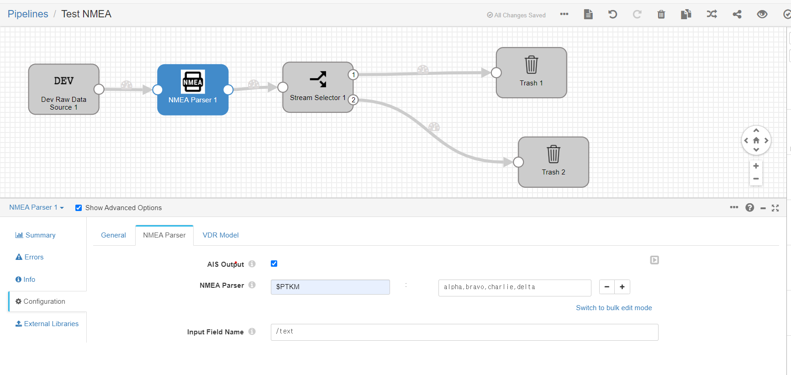
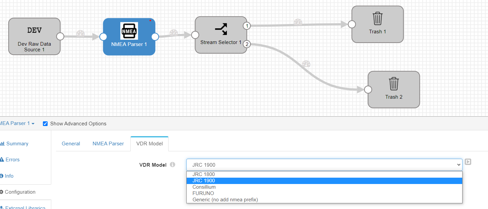

# NMEA Parser

This code is for "processing" from /text record field with String input.
Supports JRC 1800/1900 header reading with some more specific VDR model will be implemented.
Built in AIS decoder will is also implemented.

the AIS output is having "AisMmsi" field, thus the output should be separated with this field exists.


It is based on **Streamsets 3.21**


## Getting Started

This source code is based on Streamsets 3.21, Therefore you need to know basis of streamsets and custom processor's concept.

you can find it from <a>https://github.com/streamsets/tutorials/blob/master/tutorial-origin/readme.md


### Prerequisites

The module has been developed and tested version of IntelliJ and open-jdk 8-275 with ubuntu 20.04 LTS server environment and raspbian (raspberry pi).


### Installing

following command should be used to build "nmea_parser.{$version}.tar.gz".

The "tar.gz" file should be copied into "${Streamsets_root}/user-lib" and decompressed.

Console command is like below. 
```
mvn package -DskipTests 
....
cp [streamsets_root]/etc/user/lib/nmea_parser[version].tar.gz
tar -xvf nmea_parser[version].tar.gz
```


You may need to grant if you compose custom origin or destination.
But this processor doesn't need below step.
------------------------------
open the  "${Streamsets_root}/etc/sdc-security.properties" 

and put line as below;

```
grant codebase "file://${sdc.dist.dir}/user-libs/modbus_origin/-" {
  permission java.security.AllPermission;
};
```
------------------------------
You Should restart the Streamsets. if you paste files while streamsets is running.

### Running in Streamsets
Once you apply this module into the streamsets pipeline, you can see below image like,



 1. AIS Output : If checked, AIS data will be decoded with certain format. Note that "AisMmsi"' field is existed when AIS data is out. . 
    
 2. NMEA Parser
    1) There are two field, one is Header, the other is data field separated with comma (,).
    2) User can put Header string that wants to be custom parsed. 
       <br><b>*Note: Standard NMEA including AIS Sentences will not re-define with this custom parser.
 3. Input Field Name
    1) Defines input field name that comes with String type data as NMEA sentence.
 

1. VDR Model : Each model can have prefix/suffix for their own. <br> Select proper VDR model for parsing.
    1) JRC 1800/1900 : All NMEA input has prefix with customized "Date String". 
    2) FURUNO : Currently not implemented.
    3) Consillium : Currently not implemented.
    4) Generic : Bypass original input NMEA Sentence. Should fit most of devices.
    
      
                     
## Acknowledgments

<b> This processor is based on marine-api 0.12.0-SNAPSHOT. 
<br> Much appreciated for the developer "ktuukkan".
<a>https://github.com/ktuukkan/marine-api